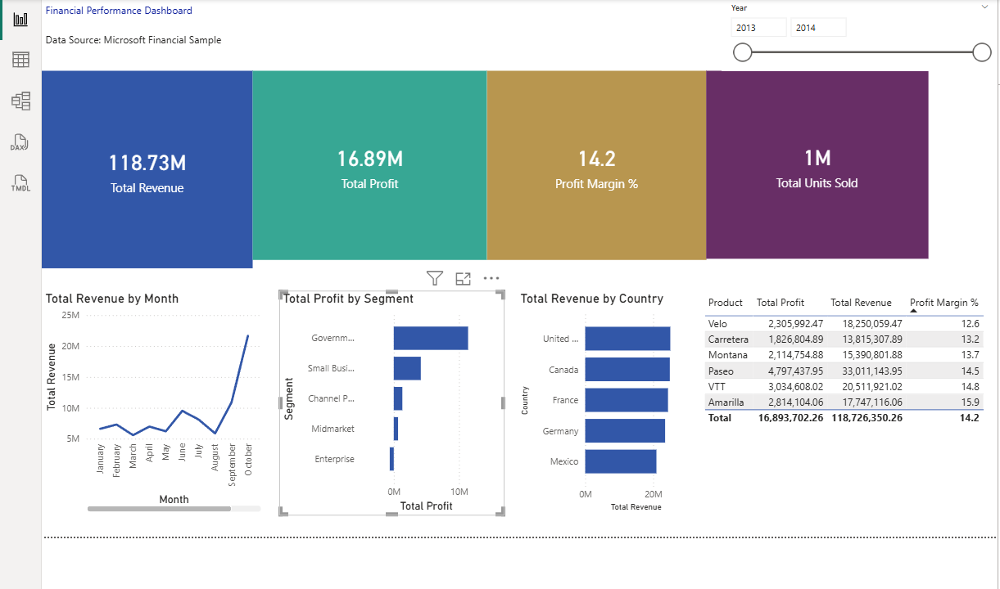

# Financial Reporting Dashboard — Power BI

An interactive financial performance dashboard built in Power BI Desktop using Microsoft's Financial Sample dataset.

## What it shows
- Monthly revenue trends and profit margins
- Profit breakdown by business segment
- Sales performance by country
- KPI cards for Revenue, Profit, Margin %, and Units Sold
- Interactive year slicer for period filtering

## Tools Used
Power BI Desktop, DAX, Power Query, Excel

## Screenshots

## Data Source
Microsoft Financial Sample Dataset
